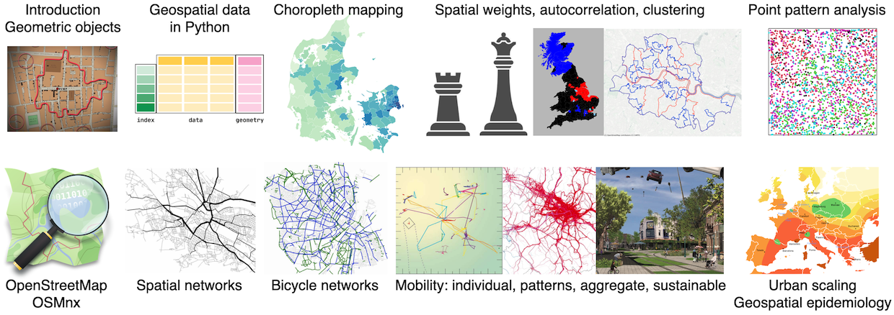

# Course materials for: Geospatial Data Science
These course materials cover the lectures for the course held for the first time in spring 2022 at IT University of Copenhagen. Public course page: [https://learnit.itu.dk/local/coursebase/view.php?ciid=940](https://learnit.itu.dk/local/coursebase/view.php?ciid=940)  
Materials were slightly improved and reordered after the course.

**Prerequisites**: Basics in data science (including statistics, Python and pandas)  
**Ideal level/program**: 1st year Master in Data Science

## Topics

· 1. Geometric objects · 2. Geospatial data in Python · 3. Choropleth mapping · 4. Spatial weights · 5. Spatial autocorrelation · 6. Spatial clustering · 7. Point pattern analysis · 8. OpenStreetMap and OSMnx · 9. Spatial networks · 10. Bicycle networks · 11. Individual mobility · 12. Mobility patterns · 13. Aggregate mobility and urban scaling · 14. Sustainable mobility and geospatial epidemiology ·

## Exercise materials and tutorials
See: [https://github.com/anerv/GDS2022_exercises](https://github.com/anerv/GDS2022_exercises)

## Schedule

## Sources
The course materials were adapted/inspired from a number of sources, *standing on the shoulders of giants*, ordered by appearance in the course:
### Main sources
Percentages are approximative.

* [7%] Tenkanen, Heikinheimo, Aagesen: [Automating GIS-processes](https://autogis-site.readthedocs.io/en/latest/)
* [40%] Arribas-Bel: [Geographic Data Science](https://darribas.org/gds_course/content/home.html)
* [7%] Boeing: [OSMnx](https://github.com/gboeing/osmnx-examples/tree/main/notebooks)
* [1%] Tenkanen: [pyrosm](https://pyrosm.readthedocs.io/en/latest/index.html)
* [2%] Gaboardo, Rey, Lumnitz: [spaghetti](https://pysal.org/spaghetti/)
* [2%] Pappalardo: [scikit-mobility](https://github.com/scikit-mobility/tutorials)
* [25%] Alessandretti, Szell: [Urban Mobility](https://arxiv.org/abs/2211.00355) (developed after the course)

### Other major sources and further materials

* Rey, Arribas-Bel, Wolf: [Geographic Data Science with Python](https://geographicdata.science/book/intro.html)
* Prapas: [Analyze Geospatial Data in Python: GeoPandas and Shapely](https://www.learndatasci.com/tutorials/geospatial-data-python-geopandas-shapely/)
* Gimond: [Intro to GIS and Spatial Analysis](https://mgimond.github.io/Spatial/index.html)
* Tan, Steinbach, Kumar: Introduction to Data Mining
* Timaite, Lovelace: [Getting started with open data on transport infrastructure](https://udsleeds.github.io/openinfra/articles/openinfra.html)
* Rodrigue: [The Geography of Transport Systems](https://transportgeography.org/)
* Barthelemy: [Spatial Networks](https://link.springer.com/book/10.1007/978-3-030-94106-2)
* Barbosa et al: [Human mobility: Models and applications](https://doi.org/10.1016/j.physrep.2018.01.001)
* Mobility papers: [Brockmann et al](https://www.nature.com/articles/nature04292), [Gonzalez et al](https://www.nature.com/articles/nature06958), [Szell et al](https://www.nature.com/articles/srep00457), [Song et al](https://www.science.org/doi/abs/10.1126/science.1177170), [Pappalardo et al](https://www.nature.com/articles/ncomms9166), [Song et al](https://www.nature.com/articles/nphys1760), [De Montjoye et al](https://www.nature.com/articles/srep01376), [Schneider et al](https://royalsocietypublishing.org/doi/abs/10.1098/rsif.2013.0246), [Sekara et al](https://www.pnas.org/content/113/36/9977.short), [Simini et al](https://www.nature.com/articles/nature10856), [Brockmann & Helbing](https://www.science.org/doi/10.1126/science.1245200), [Szell et al](https://www.nature.com/articles/s41598-022-10783-y)
* Kapp: [Privacy-preserving techniques and how they apply to mobility data](https://alexandrakapp.blog/2022/03/14/privacy-preserving-techniques-and-how-they-apply-to-mobility-data/)
* Batty: [The New Science of Cities](https://mitpress.mit.edu/books/new-science-cities)
* Barthelemy: [The Structure and Dynamics of Cities](https://www.cambridge.org/core/books/structure-and-dynamics-of-cities/50359353B081D0A38928961FE16FB2FD)
* Tenkanen: [Spatial data science for sustainable development](https://sustainability-gis.readthedocs.io/en/latest/index.html)
* OECD: [Transport Strategies for Net-Zero Systems by Design](https://www.oecd.org/environment/transport-strategies-for-net-zero-systems-by-design-0a20f779-en.htm)
* [The GDSL Big List of Teaching Links](https://github.com/GDSL-UL/Teaching_Links)

More sources are referenced within the slides and notebooks.

## License
All materials were used for educational, non-commercial reasons only. Feel free to use as you wish for the same purpose, at your own risk. For other re-use questions please consult the license of the respective source. Our main sources use the [CC BY-SA 4.0 license](https://creativecommons.org/licenses/by-sa/4.0/) so we use it too.

## Credits
Lectures: [Michael Szell](http://michael.szell.net/)  
[Exercises and tutorials](https://github.com/anerv/GDS2022_exercises): Ane Rahbek Vierø & Anastassia Vybornova

Thanks to all our main sources for being so helpful and open with your materials! Special thanks to Adéla Sobotkova for helpful discussions and materials concerning syllabus, exam form, and project description, and to Vedran Sekara for slide materials.
